<div align="center">

# Your AI Relationship Analyst Agent

### A Psychological Approach to Relationship Counseling

**你的專屬心理諮商師 🥰**

<p>
  
  
  
  
  
</p>

**[▶ Try the live demo](https://two025theory-of-computation-final-svz3.onrender.com/)**

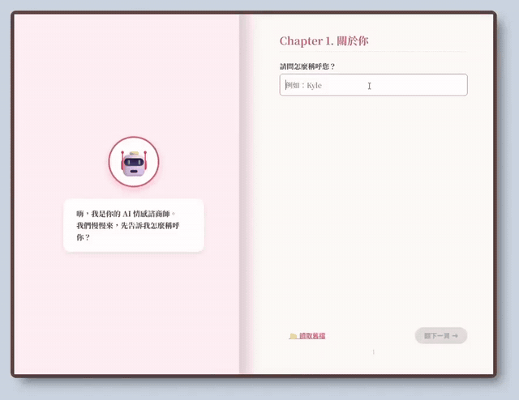

<sub>The whole loop, with the thirty seconds of waiting cut out. Same clip as
video: <a href="docs/media/demo.mp4">docs/media/demo.mp4</a></sub>

<!-- To get a native inline video player instead of the GIF above: drag
     docs/media/demo.mp4 into any github.com comment box, copy the
     https://github.com/user-attachments/assets/... URL it produces, and paste
     that URL on its own line here. GitHub only renders a player for those URLs;
     it strips <video> tags from README markdown. -->

</div>

---

## What is this?

Paste in a fight you had over text. Get back a report that tells you:

- **what attachment style** each of you is showing — secure, anxious, avoidant, or disorganized
- **which of Gottman's Four Horsemen** showed up in the messages, quoted line by line
- **the loop you're stuck in** — who pursues, who withdraws, and how it restarts
- **what to say instead**, rewritten sentence by sentence

It's dressed up as a 3D book you flip through, because a wall of `<textarea>` felt
like the wrong container for "my relationship is falling apart."

Under the hood it is a **four-state machine driving an LLM**, which is the part
that made it a Theory of Computation project rather than a psychology one. More
on that below — but let's start with what it actually produces.

---

## A worked example: 夢夢 and 威威

Everything in this section is made up. Two fictional people, one fictional
argument, run through the real system.

<table>
<tr>
<td width="50%">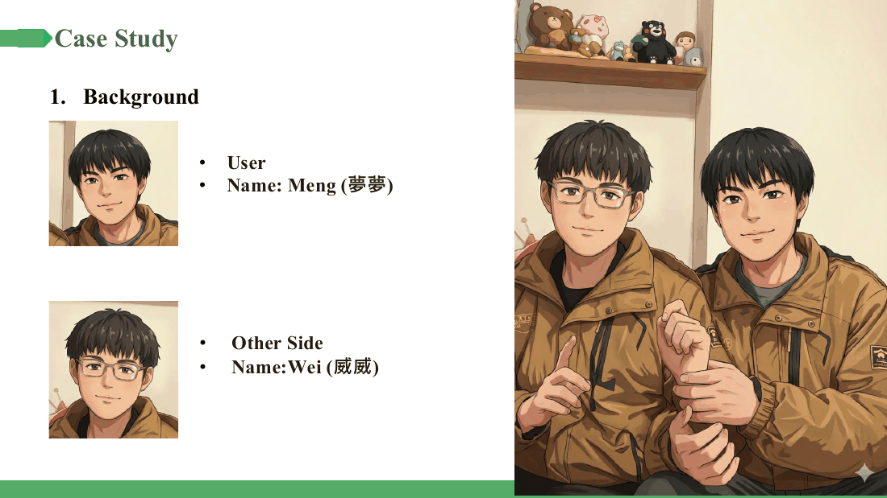</td>
<td width="50%">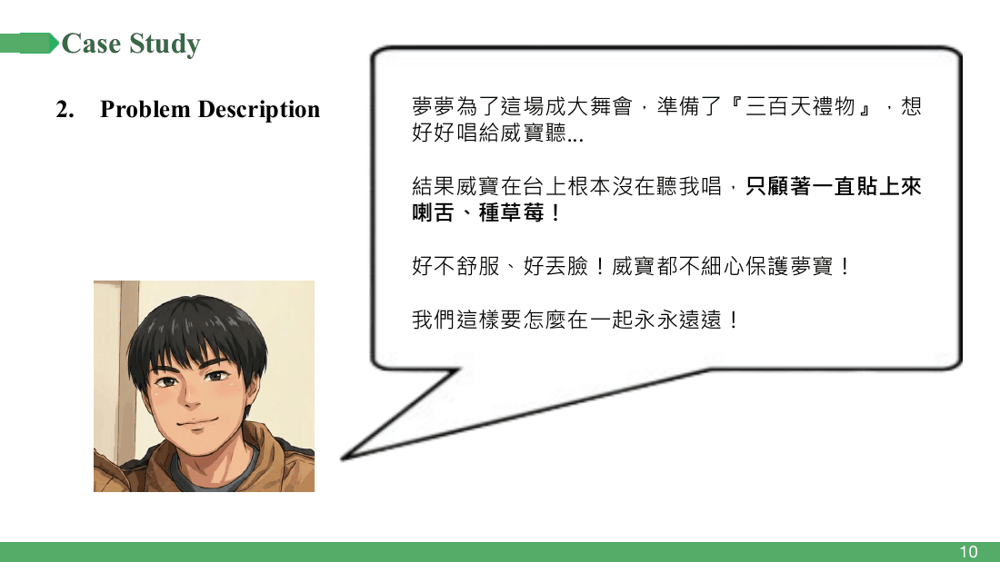</td>
</tr>
</table>

**The setup.** 夢夢 (Meng) spent weeks preparing a 300-day-anniversary song to
perform at the NCKU ball. 威威 (Wei) spent the performance clinging to her on
stage. She came off furious and humiliated. He thought he was being romantic.

**The evidence.** Five messages. That's the whole input.

<div align="center">
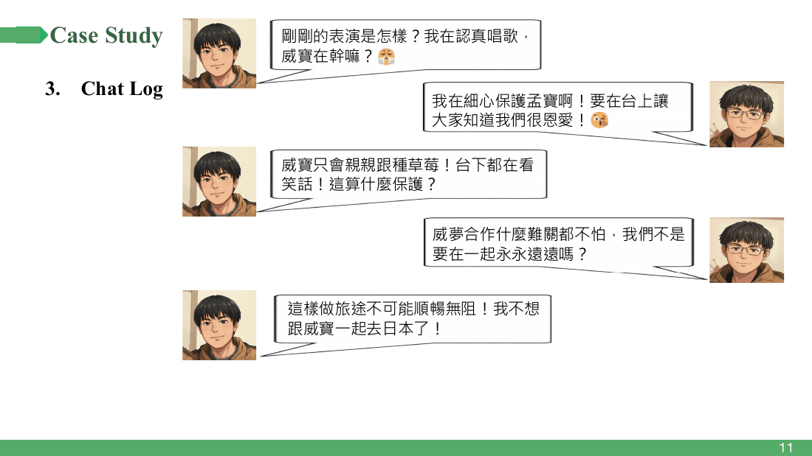
</div>

Five messages is nothing — and the agent still has plenty to work with, because
the psychology is in *how* things are said, not how much.

### What comes back

<table>
<tr>
<td width="50%">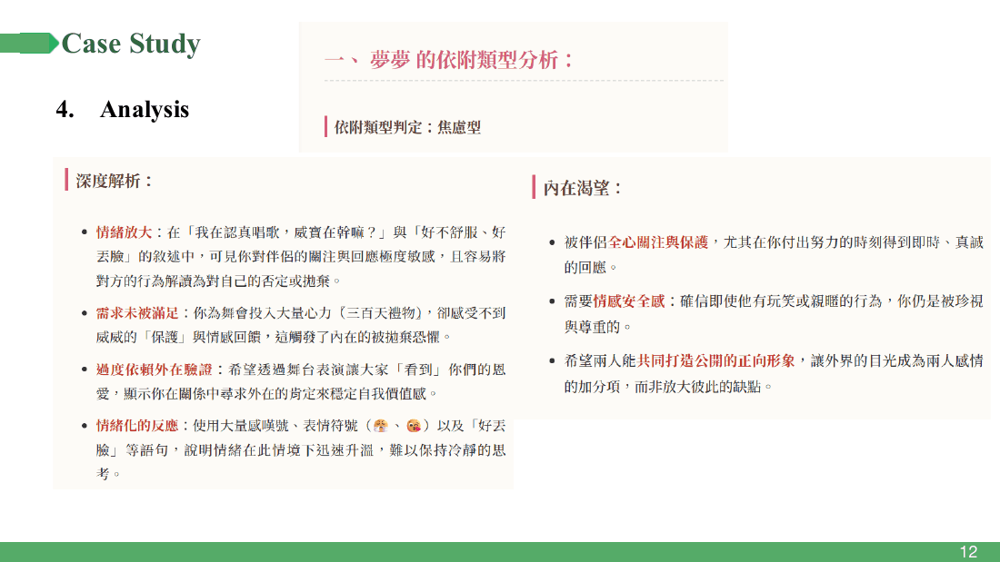</td>
<td width="50%">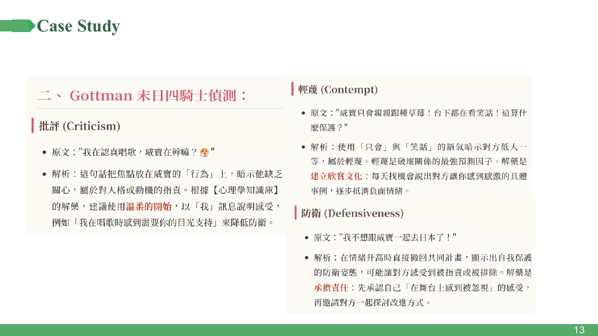</td>
</tr>
<tr>
<td><b>① Attachment style → 焦慮型 (anxious).</b> Not a label pulled from
nowhere: it cites the emotional amplification in 「我在認真唱歌，威寶在幹嘛？」,
the unmet need behind the 300-day gift, and the reliance on an audience to
confirm the relationship is real.</td>
<td><b>② The Four Horsemen, quoted.</b> Every finding carries the line that
triggered it. 「威寶只會親親跟種草莓！台下都在看笑話！」 → <b>contempt</b>, because
「只會」 and 「笑話」 put her above him. 「我不想跟威寶一起去日本了！」 →
<b>defensiveness</b>, withdrawing a shared plan mid-argument.</td>
</tr>
</table>

<table>
<tr>
<td width="50%">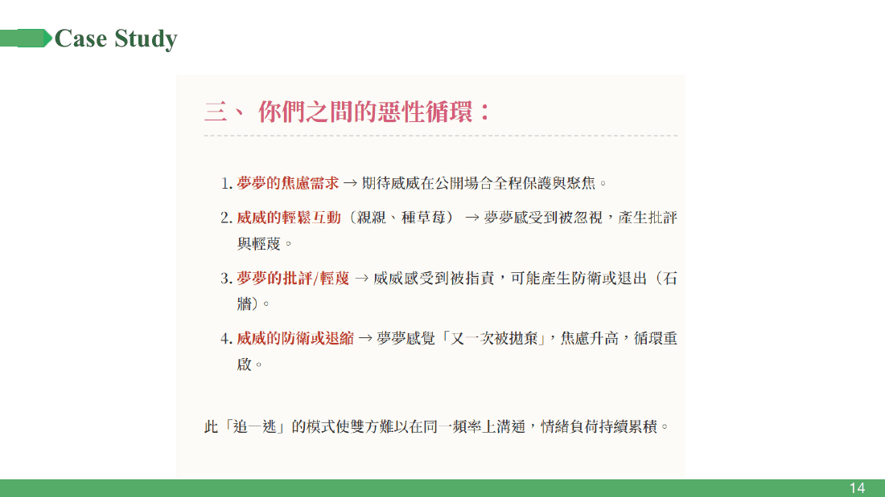</td>
<td width="50%">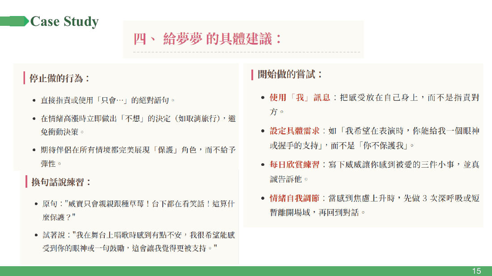</td>
</tr>
<tr>
<td><b>③ The loop.</b> Her anxiety asks for visible protection → his casual
affection reads as being ignored → her criticism lands as an attack → he
withdraws → she feels abandoned again → back to the top. A textbook
pursue–withdraw cycle, drawn from five messages.</td>
<td><b>④ What to actually say.</b> This is the part people use. Stop saying
「只會…」. Start with an I-statement. And a rewrite of her own sentence:<br><br>
「威寶只會親親跟種草莓！這算什麼保護？」<br>→<br>「我在舞台上唱歌時感到有點不安，我很希望能感受到你的眼神或一句鼓勵。」</td>
</tr>
</table>

<div align="center">
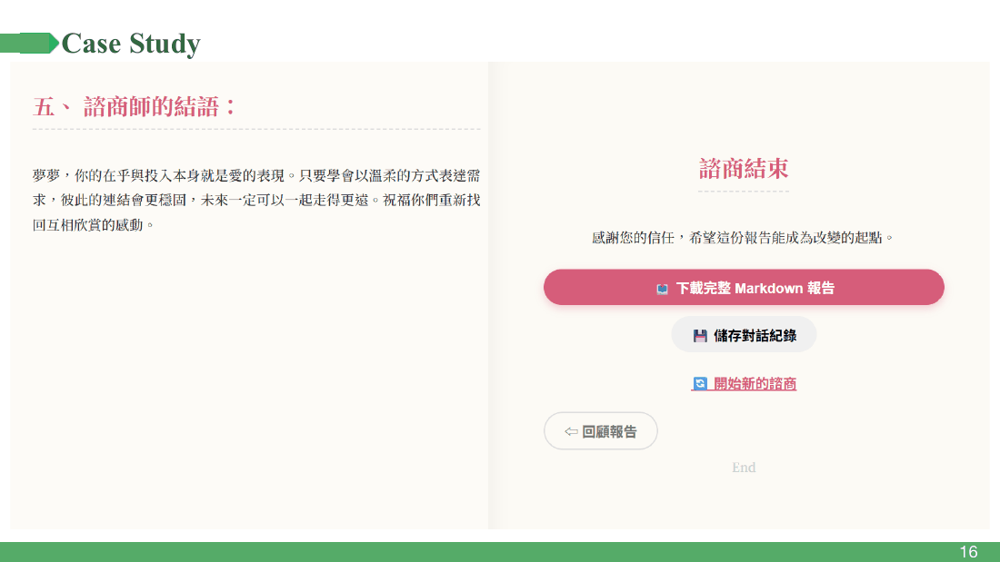
</div>

The report closes, you download it as Markdown, and the book shuts. That last
screen is deliberate — it is a counselling session, so it should end like one
rather than just stopping.

---

## The two models it argues from

The agent is not improvising psychology. It is given two published frameworks as
literal text in the prompt, and asked to apply them and show its work.

<table>
<tr>
<td width="50%">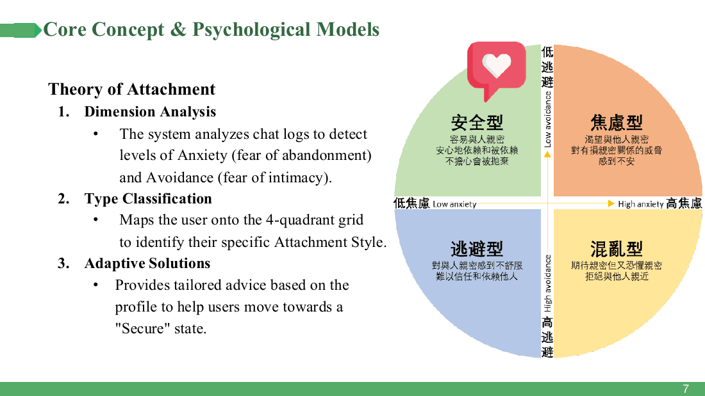</td>
<td width="50%">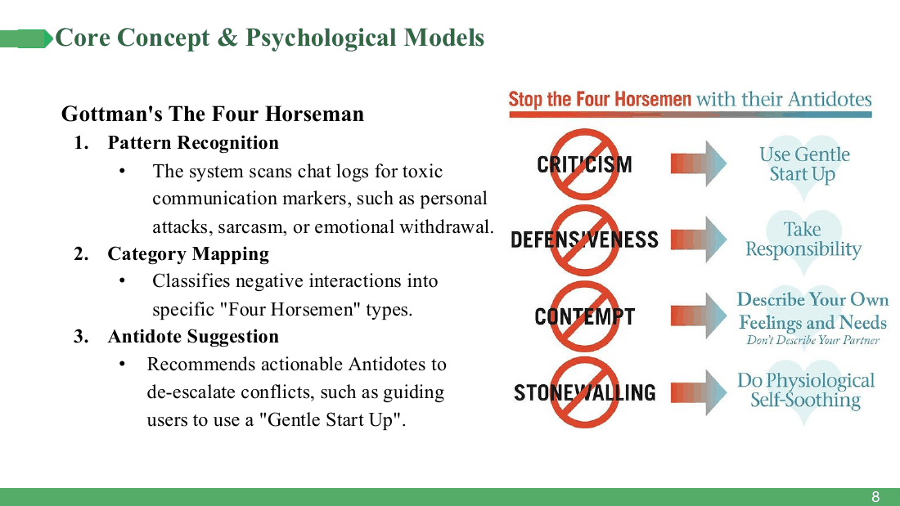</td>
</tr>
<tr>
<td><b>Attachment theory</b> — two axes, anxiety and avoidance, giving four
quadrants. The agent places each person, then aims the advice at moving them
toward <i>secure</i>.</td>
<td><b>Gottman's Four Horsemen</b> — criticism, contempt, defensiveness,
stonewalling. Each has a known antidote, and the antidotes are literally where
§④ above comes from.</td>
</tr>
</table>

Everything the report claims has to trace back to one of these two pictures. That
constraint is doing a lot of work: it turns "what does the model think" into
"where in this framework does this conversation sit", which is checkable.

---

## Why a state machine?

Here is the problem that shaped the whole design.

An LLM accepts a fixed number of tokens. A chat history does not have a fixed
length. Paste in three years of LINE messages and the naive version — one big
prompt — simply fails.

So the agent reads the transcript the way you'd read a long book with a bad
memory: **a chunk at a time, taking notes, then writing the review from the
notes.**

<div align="center">
<picture>
  <source media="(prefers-color-scheme: dark)"  srcset="docs/figures/fig1-fsm-dark.png">
  <source media="(prefers-color-scheme: light)" srcset="docs/figures/fig1-fsm-light.png">
  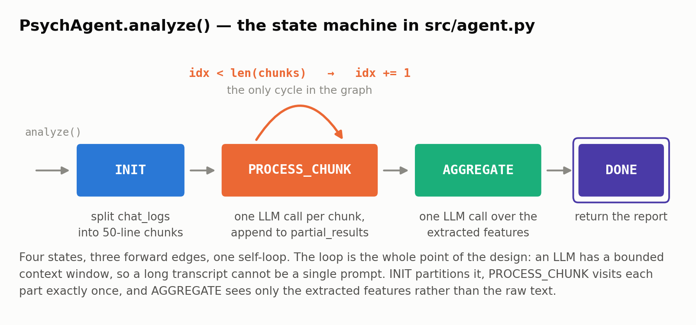
</picture>
</div>

Four states, three forward edges, one self-loop. The self-loop is the entire
point: it is what lets a fixed-size reader consume an input of any length.

```python
class State(Enum):
    INIT = 1            # cut the transcript into 50-line chunks
    PROCESS_CHUNK = 2   # one LLM call per chunk → a short note
    AGGREGATE = 3       # one LLM call over the notes → the report
    DONE = 4
```

```python
while self.state != State.DONE:
    ...
    elif self.state == State.PROCESS_CHUNK:
        if self.current_chunk_idx < len(self.chunks):
            partial = self.process_single_chunk(self.chunks[self.current_chunk_idx])
            self.partial_results.append(partial)
            self.current_chunk_idx += 1      # ← the self-loop
        else:
            self.state = State.AGGREGATE     # ← the only way out
```

It also terminates for a reason you can state in one line: `len(self.chunks)` is
fixed the moment `INIT` finishes, and `current_chunk_idx` only ever goes up.

<details>
<summary><b>For people who took the course: is this actually an FSM?</b> (click)</summary>

<br>

Not quite, and the gap is the interesting part.

<div align="center">
<picture>
  <source media="(prefers-color-scheme: dark)"  srcset="docs/figures/fig2-machine-class-dark.png">
  <source media="(prefers-color-scheme: light)" srcset="docs/figures/fig2-machine-class-light.png">
  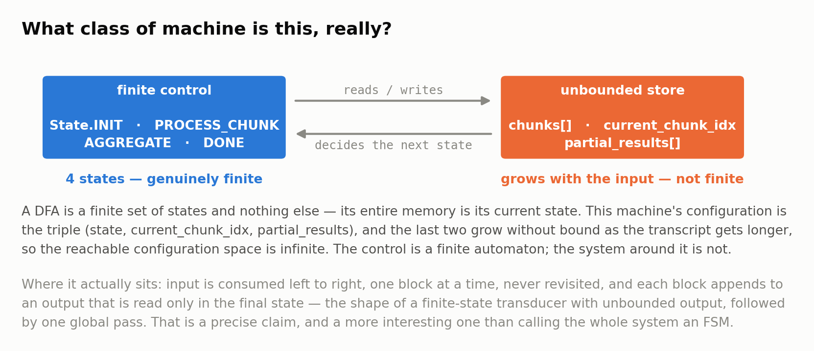
</picture>
</div>

A DFA's entire memory *is* the state it's in — that's why the pumping lemma
bites. Our configuration is the triple `(state, current_chunk_idx,
partial_results)`, and the last two grow with the input. Four states, sure, but
infinitely many configurations.

What it really is: input consumed left to right, one block at a time, never
revisited, one output appended per block, read only at the end. That's a
**finite-state transducer with unbounded output**, followed by a single global
pass. Weaker than a Turing machine (the tape is append-only and never re-read
during the scan), stronger than a DFA (the store is unbounded).

The web layer, on the other hand, genuinely *is* a finite automaton — see the
next section. Two state machines, two different answers. That contrast is the
most TOC-ish thing in the project.

</details>

---

## How it's put together

<div align="center">
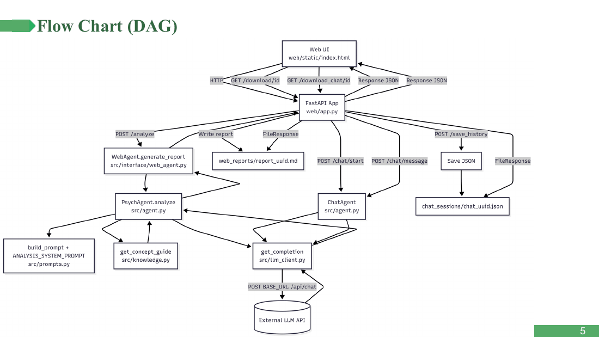
</div>

Dependencies run one way only: browser → FastAPI → `WebAgent` → `PsychAgent` →
prompts / knowledge / `llm_client` → the outside world. The one rule we actually
held to is that **`PsychAgent` never builds an HTTP request.** Everything
network-shaped lives in `llm_client.py`, which is 21 lines long. Swapping model
providers is a one-file change.

| File | What it does | Lines |
| --- | --- | ---: |
| `src/agent.py` | `PsychAgent` (the state machine) and `ChatAgent` | 124 |
| `src/prompts.py` | the analysis template + its fixed 5-section output format | 89 |
| `src/knowledge.py` | attachment theory and Gottman, written out as text | 65 |
| `src/llm_client.py` | the only network call in the project | 21 |
| `src/config.py` | key loading, gateway URL, model name | 28 |
| `web/app.py` | FastAPI routes | 160 |
| `web/static/` | the 3D book — HTML, CSS, JS | 894 |

`knowledge.py` is worth a note: it's not a vector database and doesn't pretend to
be. It's a handful of functions returning hand-written prose that gets pasted
into the prompt. For a knowledge base this small and this static, a retrieval
system would be more moving parts for less predictability.

### The web layer is a second state machine

<div align="center">
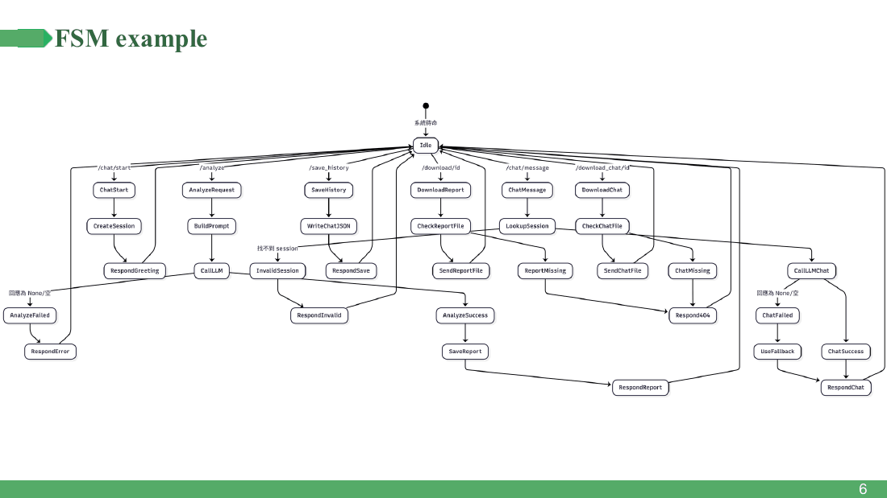
</div>

Every endpoint in `web/app.py` is a transition out of `Idle`, each with an
explicit success and failure state, and every failure edge comes back to `Idle`.
This one is a real finite automaton: the set of session states doesn't grow no
matter how long you stay on the page.

---

## Run it yourself

```bash
git clone https://github.com/pukyle/2025Theory_Of_Computation_Final_Project.git
cd 2025Theory_Of_Computation_Final_Project

python -m venv .venv && source .venv/bin/activate   # Windows: .venv\Scripts\activate
pip install -r requirements.txt

cp .env.example .env      # put your gateway key in it
python main.py            # → http://localhost:8000
```

Needs Python 3.10+ and access to the NCKU CSIE model gateway
(`api-gateway.netdb.csie.ncku.edu.tw`), which is reachable on the campus network.
The key is read from `LLM_API_KEY`, falling back to an `API.txt` in the repo root.
Both are git-ignored — please keep it that way (see below for why).

The hosted demo sleeps after 15 minutes idle, so the first request can take
30–60 seconds to wake the container. It hasn't crashed, it's just yawning.

---

## Slides and reading

- [`docs/presentation.md`](docs/presentation.md) — the full 18-slide deck as presented in class
- [`docs/media/demo.mp4`](docs/media/demo.mp4) — the demo recording, as video

**References.** Bowlby, *Attachment and Loss* (1969) · Hazan & Shaver, "Romantic
love conceptualized as an attachment process" (1987) · Gottman & Silver, *The
Seven Principles for Making Marriage Work* (1999) · Johnson, *Hold Me Tight*
(2008) · Sipser, *Introduction to the Theory of Computation*, §1.1, for the bit
about what a finite automaton's memory is and isn't.

---

## The team

Theory of Computation (2025), NCKU CSIE.

| | Student ID | Mostly worked on |
| --- | --- | --- |
| **王駿愷** (`JKaiWang`) | F74122250 | FastAPI backend, the 3D book front end, the agent wrappers, most of `agent.py` |
| **部政佑** (`pukyle`) | AN4126018 | `llm_client.py`, `config.py`, `main.py`, `prompts.py`; co-author of `agent.py` and `knowledge.py` |
| **彭以呈** (`Peng Yi Cheng`) | F74122137 | `agent.py`, front-end integration |

Summarised from `git log --format='%an' -- <path>`; a few commits were made under
machine-local usernames and are folded into the nearest author.

This README, the two generated figures, and the "things we got wrong" section were
written after the fact by [部政佑](https://github.com/pukyle) and are not part of
the original submission. The course handout is not redistributed here.

> **One honest disclaimer.** This thing produces confident psychological claims
> about real people from their private messages. It is a course project, not a
> clinical instrument, and neither framework it uses was designed to be applied
> by an unsupervised language model to someone's chat history without their
> consent. The example above is fictional for exactly that reason.
