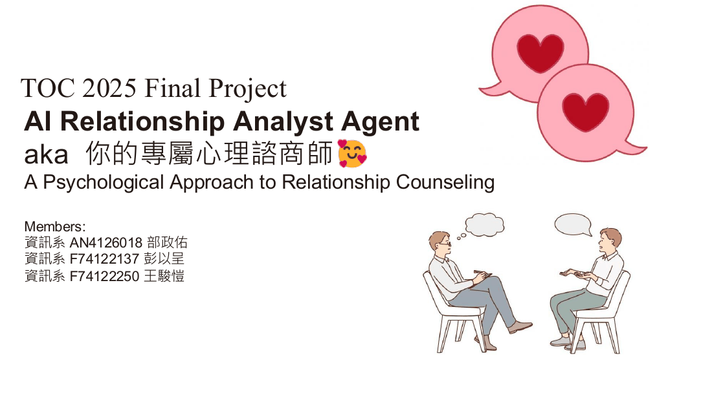
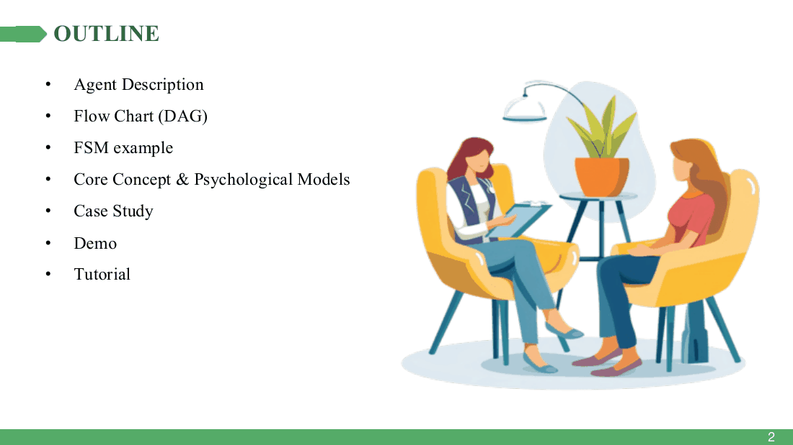
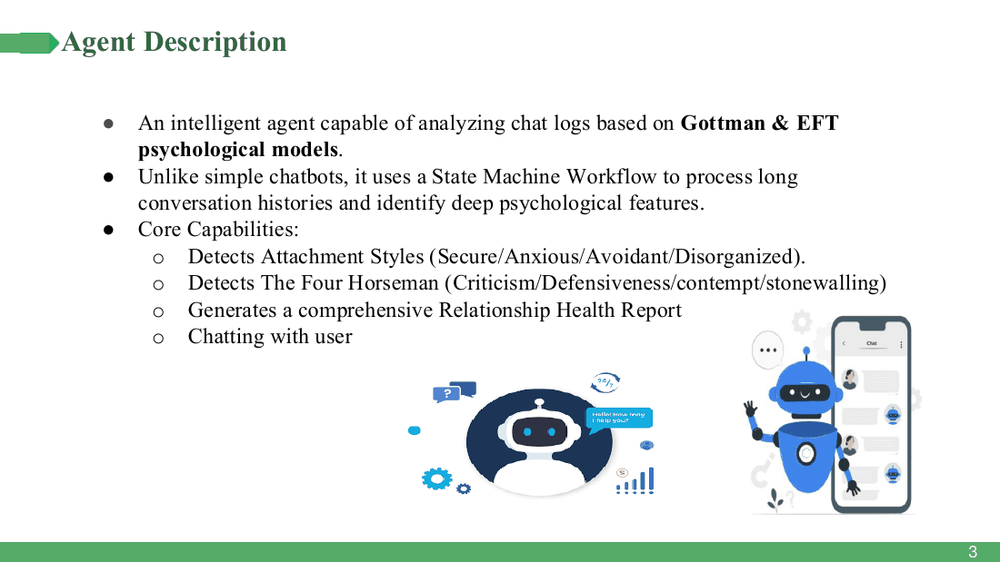
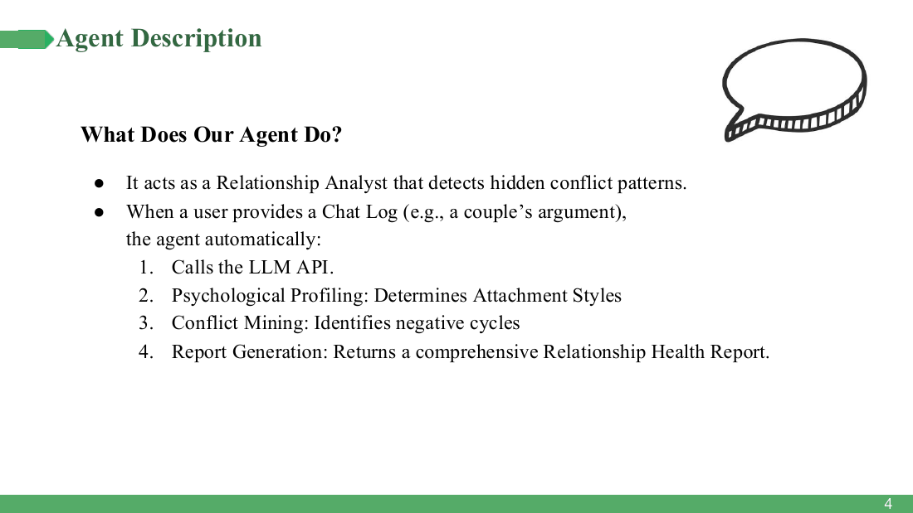
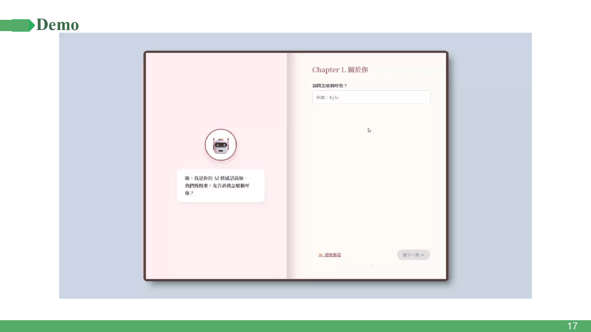
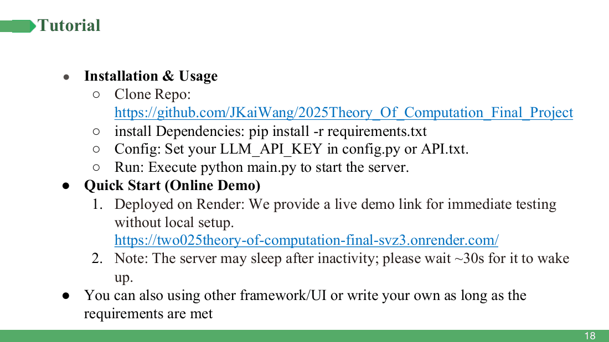

# The slide deck

### Theory of Computation (2025) Final Project · NCKU CSIE
### Your AI Relationship Analyst Agent — A Psychological Approach to Relationship Counseling

All 18 slides as presented in class. The [README](../README.md) walks through the
same material with more explanation; this is the deck itself.

A note on the case study (slides 9–16): **夢夢 and 威威 are fictional.** The
avatars are AI-generated, the argument was written for the presentation, and the
analysis you see is the real system's output on that invented input. No real
conversation appears anywhere in this deck.

---

### 1 · Title

### 2 · Outline

### 3 · Agent description — capabilities

### 4 · Agent description — what it does

> These two slides describe the agent as *choosing* between an analysis tool and
> a conflict-mining tool. It doesn't — there is no function calling in the code.
> See "Things we got wrong" in the README. Reproduced as presented rather than
> quietly corrected.

### 5 · Flow chart (DAG)

### 6 · FSM example — the session state machine

### 7 · Core concept — attachment theory

### 8 · Core concept — Gottman's Four Horsemen

---

## Case study — 夢夢 & 威威 (fictional)

### 9 · Background

### 10 · Problem description

### 11 · Chat log — the entire input

### 12 · Analysis ① — attachment style

### 13 · Analysis ② — the Four Horsemen, quoted

### 14 · Analysis ③ — the vicious cycle

### 15 · Analysis ④ — concrete suggestions

### 16 · Closing

---

### 17 · Demo

The recording shown in class: [`media/demo.mp4`](media/demo.mp4), also animated
at the top of the [README](../README.md). The input is a short exchange between
two of us, used with permission — the analysis it produces is about real people,
unlike the 夢夢/威威 case study above.

### 18 · Tutorial

> The clone URL on this slide points at the original team repository
> (`JKaiWang/…`). This fork is `pukyle/…`; both work.
